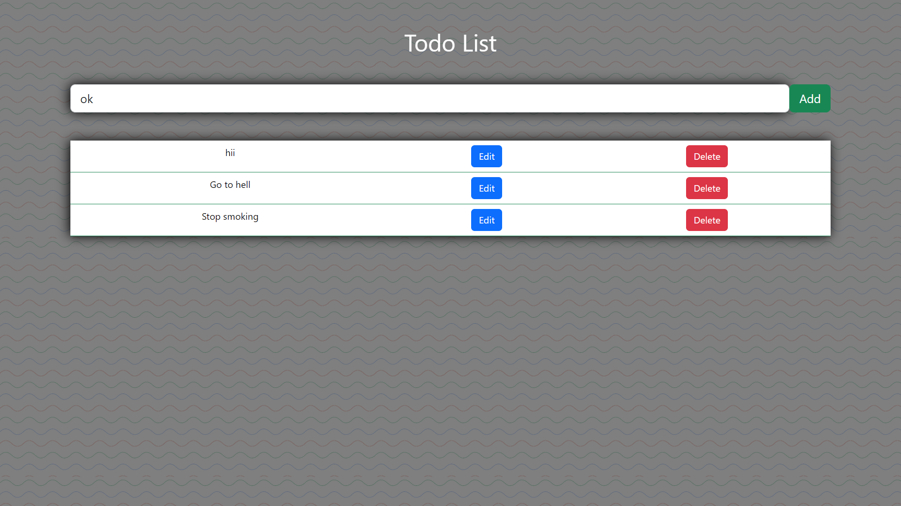

# PERN stack project
## _Todo list_


power by react and postgreSQL ,
also responsive for mobile devices



- Type some Markdown on the left
- See HTML in the right
- ✨Magic ✨

## Features

- full responsive
- 😁


## Tech

Dillinger uses a number of open source projects to work properly:

- [ReactJS] - HTML enhanced for web apps!
- [vs code] - awesome text editor
- [bootstrap  css] - great UI boilerplate for modern web apps
- [node.js] - evented I/O for the backend.

## Installation

Dillinger requires [Node.js](https://nodejs.org/) v10+ to run.

Install the dependencies and devDependencies and start the server.

```sh
cd server
npm i
nodemon index.js
cd ..
```

For running app...

```sh
cd client
npm run dev
o + Enter
```

# Important
postgreSQL should be installed on your device 
and make sure to create a table that should match the table name in the 
server and change the password 

**Free Software, Hell Yeah!**


